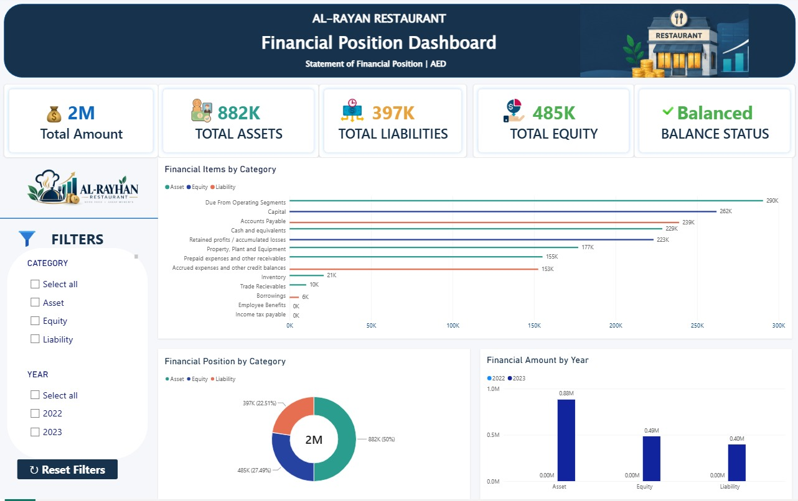

# 📊 AL-RAYAN Financial Position Dashboard

An interactive **Power BI dashboard** developed to analyze the financial position of **AL-RAYAN Restaurant**. The dashboard provides a clear overview of assets, liabilities, equity, and overall financial balance.

## 📸 Dashboard Preview

---

## 📌 Project Overview

The **AL-RAYAN Financial Position Dashboard** transforms financial statement data into an interactive and visually intuitive report.

The dashboard enables users to:

- Monitor key financial KPIs
- Analyze financial accounts by category
- Compare Assets, Liabilities, and Equity
- Compare financial amounts across years
- Check the overall financial balance
- Interactively filter the analysis by category and year

---

## 💰 Key Financial Metrics

| Metric | Value |
|---|---:|
| 💰 Total Amount | 2M AED |
| 🏦 Total Assets | 882K AED |
| 💳 Total Liabilities | 397K AED |
| 💵 Total Equity | 485K AED |
| ✅ Balance Status | Balanced |

---

## 📊 Dashboard Visualizations

### 1. Financial Items by Category

A horizontal bar chart displaying individual financial accounts and their corresponding amounts.

Financial items are classified into:

- **Assets**
- **Liabilities**
- **Equity**

This visualization helps identify the largest financial items within the financial position.

### 2. Financial Position by Category

A donut chart illustrating the overall distribution of:

- Assets
- Liabilities
- Equity

The chart also displays the percentage contribution of each category to the total financial position.

### 3. Financial Amount by Year

A column chart comparing financial amounts across:

- **2022**
- **2023**

This provides a year-wise view of the organization's financial position.

---

## 🔎 Interactive Filters

The dashboard includes interactive slicers that allow users to filter the analysis by:

### Category
- Asset
- Liability
- Equity

### Year
- 2022
- 2023

A **Reset Filters** button is included to quickly return the dashboard to its default view.

---

## 🧹 Data Cleaning & Transformation

The source data was prepared and transformed using **Power Query**.

Key data preparation steps included:

- Cleaning financial account names
- Removing unnecessary data
- Handling missing values
- Standardizing data values
- Correcting data types
- Transforming year and amount fields
- Creating a financial classification column
- Categorizing accounts into Assets, Liabilities, and Equity

---

## 🧮 DAX Measures

DAX measures were created to calculate the key financial metrics displayed in the dashboard.

Key calculations include:

- **Total Amount**
- **Total Assets**
- **Total Liabilities**
- **Total Equity**
- **Balance Difference**
- **Balance Check**

The balance check follows the accounting equation:

> **Assets = Liabilities + Equity**

The dashboard displays **Balanced** when the financial position satisfies this relationship.

---

## 🎨 Dashboard Design

The dashboard uses a consistent visual theme to improve readability and interpretation.

### Color Coding

- 🟢 **Assets** — Teal
- 🟠 **Liabilities** — Orange
- 🔵 **Equity** — Navy Blue
- 🟢 **Balanced Status** — Green

The dashboard also includes:

- KPI cards
- Financial icons
- Interactive slicers
- Reset Filters button
- Consistent typography
- Financial/restaurant themed visuals

---

## 🛠️ Tools & Technologies

| Tool | Purpose |
|---|---|
| **Power BI Desktop** | Dashboard development and visualization |
| **Power Query** | Data cleaning and transformation |
| **DAX** | Financial calculations and measures |
| **Microsoft Excel** | Source data |

---

## 📁 Project Files

| File | Description |
|---|---|
| `Financial Power Dashboard_Raiza.pbix` | Power BI dashboard |
| `AL-RAYAN_FINANCIAL_POSITION_DASHBOARD.png` | Dashboard preview |
| `README.md` | Project documentation |

---

## 🎯 Key Insights

The dashboard provides a consolidated view of the organization's financial position.

- **Total Assets:** 882K AED
- **Total Liabilities:** 397K AED
- **Total Equity:** 485K AED
- **Total Financial Amount:** approximately 2M AED
- The financial position is **Balanced**.
- Assets represent approximately half of the total financial position.
- The dashboard allows users to analyze individual financial accounts and categories interactively.

---

## 📈 Business Value

This dashboard can help stakeholders:

- Quickly understand the organization's financial position
- Identify major asset and liability accounts
- Evaluate the relationship between assets, liabilities, and equity
- Compare financial information across years
- Perform interactive financial analysis
- Support data-driven financial decision-making

---

## 👩‍💻 Author

**Raiza Samad**

**Power BI | Data Analytics | QA Engineering**

